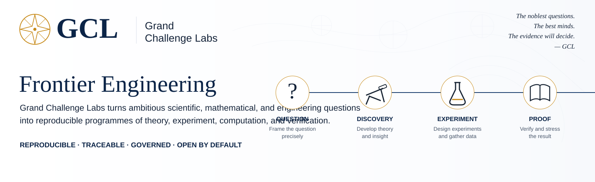

# Grand Challenge Labs

**Frontier Engineering.** Grand Challenge Labs turns difficult scientific, mathematical, and engineering questions into reproducible programmes of theory, experiment, computation, and verification.

[Explore the work](https://github.com/orgs/grandchallenge/repositories) · [Mathematics Programme](https://grandchallenge.github.io/MATH-PROGRAMME/) · [Programme Atlas](https://grandchallenge.github.io/MATH-PROGRAMME/PROGRAMME_ATLAS/) · [Discussions](https://github.com/orgs/grandchallenge/discussions)

> **The operating idea:** ambitious questions should become executable research; executable research should produce inspectable evidence; only what survives review should be promoted.

---

## What we work on

| Mathematical discovery | Intelligence & learning | Neural systems |
|---|---|---|
| Formalization, solving, certification, computational mathematics | Representation, reasoning, memory, agency, knowledge systems | Architectures, optimization, dynamics, interpretability, collective computation |

| Scientific computing | Quantum & physical systems | Research infrastructure |
|---|---|---|
| Operators, solvers, numerical methods, simulation and modelling | Quantum algorithms, geometry, physical modelling and experiments | Reproducibility, governance, coordination, verification and knowledge systems |

---

## Current frontiers

| Question | Research line |
|---|---|
| **Can neural systems phase-lock useful computational modes while suppressing error modes?** | Coupling-Phase Spectroscopy; collective neural computation; spectral dynamics |
| **When does sparse expert routing undergo genuine oscillatory instability rather than ordinary expert collapse?** | MoE flutter boundaries; bifurcation analysis; continuation experiments |
| **Can intelligence be understood as constrained distributional dynamics?** | Operators; semantic transport; memory; representation |
| **Can mathematical discovery become an auditable computational pipeline?** | Formalization → solving → independent certification → publication |
| **How should learning systems be designed to remain capable under stress rather than merely stable at nominal conditions?** | Antifragile training; recovery dynamics; reserve and robustness |
| **Can operator methods expose and control long-horizon structure in complex learned systems?** | Koopman diagnostics; spectral memory; boundary-aware optimization |

These are research questions, not promoted claims. Evidence and claim status live with the governed programme records that support them.

---

## How the laboratory becomes executable

Ideas at GCL are not left as isolated papers or prototypes. Research is decomposed into programmes, repositories, experiments, evidence, review, and publication surfaces that can be independently inspected and reproduced.

*Organization-surface illustration, September 2026. This is a navigational summary; protected, content-addressed records in the governed repositories remain authoritative.*

---

## How GCL works

| 1. Frame the question | 2. Make it executable | 3. Attack the result | 4. Publish what survives |
|---|---|---|---|
| State the conjecture, engineering objective, or scientific uncertainty precisely. | Build theory, experiments, datasets, software, proofs, and diagnostics. | Reproduce, review, falsify, verify, and establish the claim boundary. | Promote only the evidence-supported result, with provenance attached. |

GitHub supplies the operational and evidentiary substrate; it does not itself confer mathematical or scientific authority.

---

## Core programme architecture

| Programme | Role |
|---|---|
| [**MATH-PROGRAMME**](https://github.com/grandchallenge/MATH-PROGRAMME) | Mathematics-programme authority; programme map, governance, admissions and adopted standards |
| [**MATHFORGE**](https://github.com/grandchallenge/MATHFORGE) | Reconstruction, formalization and mathematical discovery |
| [**MATHSOLVE**](https://github.com/grandchallenge/MATHSOLVE) | Disciplined solving campaigns and work packages |
| [**MATHCERT**](https://github.com/grandchallenge/MATHCERT) | Independent certification, checked evidence and claim disposition |
| [**INTELLECT**](https://github.com/grandchallenge/INTELLECT) | Reasoning, coordination, institutional cognition and constitutional records |
| [**gcl-standards**](https://github.com/grandchallenge/gcl-standards) | Versioned cross-programme standards and controlled vocabulary |

### Selected research repositories

[AETHER](https://github.com/grandchallenge/AETHER) · [MODULUS](https://github.com/grandchallenge/MODULUS) · [QUANTUM-TECHNOLOGIES](https://github.com/grandchallenge/QUANTUM-TECHNOLOGIES) · [GLOSS](https://github.com/grandchallenge/GLOSS) · [TROVE-CURATA](https://github.com/grandchallenge/TROVE-CURATA) · [CPS](https://github.com/fyremael/CPS) · [MUONSPHERE](https://github.com/fyremael/MUONSPHERE) · [SPECTRALMEM](https://github.com/fyremael/SPECTRALMEM) · [TENSORGRAPH](https://github.com/fyremael/TENSORGRAPH) · [SEMANTIC_SURGERY](https://github.com/fyremael/SEMANTIC_SURGERY) · [ITERANT](https://github.com/fyremael/ITERANT) · [RUNT](https://github.com/fyremael/RUNT) · [LEANSITE](https://github.com/fyremael/LEANSITE) · [SEEDNET](https://github.com/fyremael/SEEDNET)

---

## Evidence, not ceremony

GCL research is designed to be inspectable rather than merely persuasive. Depending on the programme and claim class, that can include exact-head review, reproducible experiments, protected evidence, independent review, formal verification, explicit claim boundaries, immutable attestations, and post-merge readback.

[Three-pillar architecture](https://github.com/grandchallenge/MATH-PROGRAMME/blob/main/ARCHITECTURE_OVERVIEW.md) · [Certification ladder](https://github.com/grandchallenge/MATH-PROGRAMME/blob/main/CERTIFICATION_LADDER.md) · [Claim-boundary doctrine](https://github.com/grandchallenge/MATH-PROGRAMME/blob/main/docs/CLAIM_BOUNDARY_DOCTRINE.md) · [Standards](https://github.com/grandchallenge/gcl-standards)

<strong>Current governed status</strong>

- `GI-AMEND-0001` is effective under the protected [INTELLECT authority schedule](https://github.com/grandchallenge/INTELLECT/blob/main/governance/constitutional_authority_schedule.json).
- `GCL-GHOS-00` `0.2.0` is the admitted bounded-execution-continuity successor selected for the MATH-PROGRAMME pilot by [protected admission `87307a0c1fe5ff19b34bb08451e7d6281a7d5dea`](https://github.com/grandchallenge/gcl-standards/commit/87307a0c1fe5ff19b34bb08451e7d6281a7d5dea).
- MATH-PROGRAMME actively adopts that exact admission through [protected adoption `1a5e9cb24257be578b091ecd2c99d4119ff73b2c`](https://github.com/grandchallenge/gcl-standards/commit/1a5e9cb24257be578b091ecd2c99d4119ff73b2c), while retaining the `0.1.1` and `0.1.0` lineage as history.

Machine-readable activation, admission, and adoption records take precedence over descriptive documents. These statuses do not grant GitHub independent constitutional, mathematical, certification, production, deployment, novelty, or commercial authority.

---

## Enter the laboratory

Read the research. Reproduce an experiment. Challenge a result. Improve a proof. Build on what survives.

[Programme Atlas](https://grandchallenge.github.io/MATH-PROGRAMME/PROGRAMME_ATLAS/) · [Repositories](https://github.com/orgs/grandchallenge/repositories) · [Discussions](https://github.com/orgs/grandchallenge/discussions) · [Mathematics Programme](https://grandchallenge.github.io/MATH-PROGRAMME/)

**Grand Challenge Labs**  
Reproducible · Traceable · Governed · Open by default · Built for Frontier Engineering
